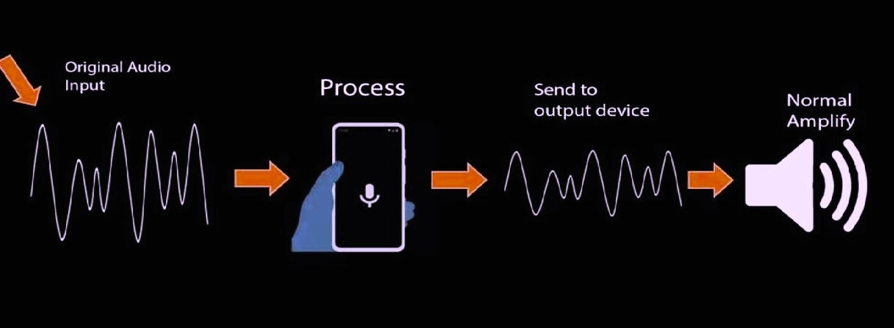

<h1 align="center">Digital Hearing Aid :ear_with_hearing_aid:</h1>

## Overview

Our project is an app for those people that are both autistic and have hearing aid disability. The app takes sound input and will then process and amplify the sound according to the user’s need. Every hearing loss is different which is why the doctor will specify the highest and lowest decibel of sound tolerated by that specific patient and it will be set inside the app accordingly.

The app will also detect loud sounds and optimize it to a lower level for the user based on their specific range. After the sound enters the app, it is then amplified as well as the high amplitude sounds are suppressed and brought down to an optimum level for the user so that it doesn’t affect their hearing loss further. This app is also suitable for those that works in high noise environment like construction as noise reduction is one of our app’s features.

## Key Features

- **Custom Sound Processing**: The app processes incoming sounds and optimizes loud sounds by reducing them to a lower level within the user's specific comfort range. It also suppresses high amplitude sounds to prevent further hearing loss.
- **Noise Reduction**: This feature is especially beneficial for users in high-noise environments such as construction sites, aiding in clearer sound reception.
- **User-Centric Design**: Tailored for both autistic individuals and those with hearing impairments, accommodating their specific auditory needs.

## Application Details

This app involves sophisticated signal processing that requires significant computing power, more than what normal mobile devices and hearing aids typically provide. Hence, our approach combines advanced software algorithms with minimal hardware dependency, allowing for a balance between performance and usability.

### Technological Limitations

The primary challenges have been in advancing noise cancellation technology within the constraints of current hardware capabilities. While the software efficiently handles various sound processing tasks, the hardware-focused 'Active Noise Cancellation' remains a development goal.

### Testing and Feedback

The application has undergone extensive testing by individuals without hearing impairments due to ethical considerations in using real patients. Feedback from users who tested the application using headphones and earbuds with noise cancellation features has been overwhelmingly positive.

## Download
**Download the Application**: Click [here](https://github.com/nehlinshanila/Digital-Hearing-Aid/blob/master/Hearing%20Aid-1.0.apk) to download the `Hearing Aid-1.0.apk` Apk.

## Installation Setup & Guide in your phone
**Install the Application**: Follow the installation steps provided below: 

1. **Prepare for Installation**:
   - If your device blocks the installation since it is an unknown app, tap on `Settings` in the prompt that appears.
   - In the settings menu, enable the toggle for `Allow Permission`, `Allow from this source` or `Install unknown apps`.

1. **Begin Installation**:
   - After enabling installation from unknown sources, return to the APK file and tap on it again.
   - Select `Package Installer` if prompted, then tap `Just once`.
   - Tap `Install` to proceed with the installation.

1. **Handle Security Prompts**:
   - If Google Play Protect warns you about the app, tap on `More details`.
   - Then, choose `Install anyway` to proceed.

1. **Launch the App**:
   - After the installation is complete, tap `Open` to start the application.

1. **Enable Microphone Access**:
   - When prompted, allow the app to record audio by selecting `While using the app` to ensure it functions properly.

### Step 7: Start Using the App

1. **Configure and Use**:
   - Upon launching, adjust the application settings as required.
   - Start using the application by navigating through its features as per the on-screen instructions.

### Quick Start

3. **Configuration**: Upon first launch, adjust the settings according to your hearing preferences as directed by a healthcare professional.

## Usage Instructions

- **Start the Application**: Open the app and begin by recording the surrounding sounds.
- **Adjust the Amplification**: Use the in-app sliders to adjust the sound amplification levels.
- **Stop Recording**: Discontinue recording when no longer needed.

We are dedicated to continuously improving our application to better serve our users and appreciate any feedback that can help us achieve this goal.
